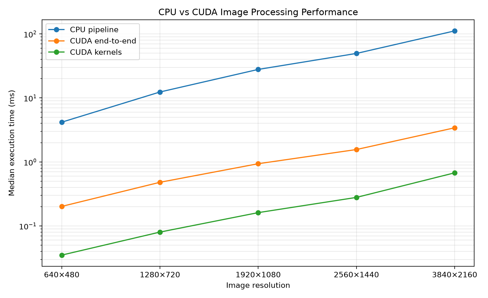
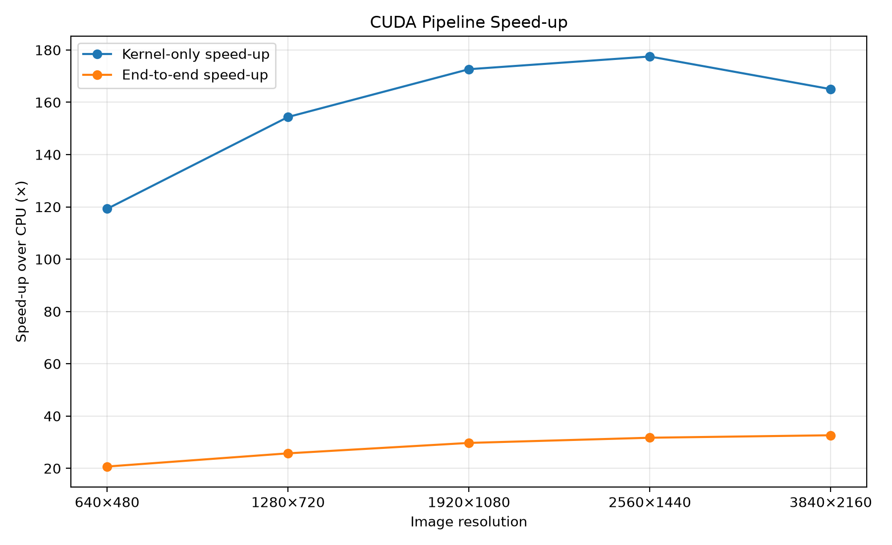

# CUDA Image Processing

A C++ and CUDA image-processing pipeline implementing greyscale conversion, Gaussian blur and Sobel edge detection on both the CPU and GPU.

The project was built to practise CUDA kernel development, GPU memory management, performance benchmarking and profile-guided optimisation. The CUDA pipeline keeps intermediate images resident on the GPU, requiring only one host-to-device transfer at the beginning and one device-to-host transfer at the end.

## Pipeline

```text
RGB Image
    ↓
Greyscale
    ↓
5×5 Gaussian Blur
    ↓
3×3 Sobel Edge Detection
    ↓
Output Image
```

CPU and CUDA implementations are provided for each processing stage.

## Image Results

### Input


### Greyscale


### Gaussian Blur


### Sobel Edge Detection


## Performance

The CPU and CUDA pipelines were benchmarked across five image resolutions ranging from 640×480 to 3840×2160.

Each resolution used a warm-up run followed by 10 timed trials. The median execution time was used for the final result.

CUDA performance was measured in two ways:

- **Kernel-only time** — execution of the three CUDA processing kernels.
- **End-to-end time** — host-to-device transfer, CUDA kernels and device-to-host transfer.

| Resolution | CPU (ms) | CUDA Kernels (ms) | CUDA End-to-End (ms) | Kernel Speed-up | End-to-End Speed-up |
|---|---:|---:|---:|---:|---:|
| 640×480 | 4.179 | 0.035 | 0.202 | 119.3× | 20.7× |
| 1280×720 | 12.377 | 0.080 | 0.481 | 154.4× | 25.7× |
| 1920×1080 | 27.867 | 0.161 | 0.938 | 172.6× | 29.7× |
| 2560×1440 | 49.528 | 0.279 | 1.562 | 177.5× | 31.7× |
| 3840×2160 | 111.454 | 0.675 | 3.414 | 165.0× | 32.7× |

At 4K resolution, the CUDA implementation achieved approximately **32.7× end-to-end speed-up** over the sequential CPU pipeline.

### Execution Time



### Speed-up



The raw benchmark results are available in [`benchmarks/results.csv`](benchmarks/results.csv).

## Validation

Each CUDA processing stage was compared against its CPU equivalent.

For the 3267×2178 test image:

```text
Greyscale mismatches (>1):     0
Greyscale max difference:      1

Gaussian blur mismatches (>1): 0
Gaussian blur max difference:  0

Sobel mismatches (>1):         0
Sobel max difference:          0
```

The refactored device-resident CUDA pipeline was also compared directly against the original CUDA pipeline:

```text
Mismatches:     0
Max difference: 0
```

For the complete CPU-vs-CUDA pipeline, 560 pixels differed by more than 1 intensity level and the maximum difference was 4 across approximately 7.1 million pixels.

The small difference originates from floating-point rounding in the greyscale stage and is amplified slightly by the later Sobel operation.

## Device-Resident CUDA Pipeline

The initial CUDA implementation used separate wrappers for each stage. This meant individual stages could allocate memory and transfer data independently.

The final pipeline instead allocates GPU buffers once and keeps intermediate data on the device:

```text
Host RGB Image
      │
      │ Host → Device
      ▼
GPU RGB Buffer
      │
      ▼
Greyscale Kernel
      │
      ▼
GPU Greyscale Buffer
      │
      ▼
Gaussian Blur Kernel
      │
      ▼
GPU Blur Buffer
      │
      ▼
Sobel Kernel
      │
      ▼
GPU Sobel Buffer
      │
      │ Device → Host
      ▼
Host Output
```

This avoids unnecessary transfers between processing stages and allows kernel-only and end-to-end GPU performance to be measured separately.

## Profiling

CUDA event timing was used to profile the three kernels at 4K resolution.

| Kernel | Execution Time | Share of Kernel Time |
|---|---:|---:|
| Greyscale | 0.198 ms | 27.1% |
| Gaussian Blur | 0.351 ms | 48.1% |
| Sobel | 0.181 ms | 24.8% |

Gaussian blur was identified as the largest contributor to total kernel execution time, accounting for approximately **48%** of measured kernel time.

Hardware performance counters through Nsight Compute were unavailable in the cloud environment, so optimisation decisions were based on CUDA event timing rather than low-level performance-counter metrics.

## Gaussian Blur Optimisation Experiments

After profiling identified Gaussian blur as the largest kernel, two alternative implementations were tested.

### Shared-Memory Tiling

A tiled implementation loaded a 20×20 region into shared memory for each 16×16 output block. The aim was to reduce repeated global-memory reads between neighbouring threads.

### Separable Convolution

The 5×5 Gaussian kernel is separable, allowing it to be represented as horizontal and vertical 1D filters:

```text
1  4  6  4  1
```

This reduced the convolution from 25 weighted neighbour operations per pixel to two passes of five operations.

### Measured Results

| Implementation | 4K Median Time | Relative Performance |
|---|---:|---:|
| Baseline 5×5 | **0.355 ms** | **1.000×** |
| Shared-memory tiled | 0.386 ms | 0.920× |
| Separable 5+5 | 0.454 ms | 0.781× |

Both experimental implementations produced output identical to the baseline:

```text
Shared-memory mismatches: 0
Shared-memory max difference: 0

Separable mismatches: 0
Separable max difference: 0
```

However, neither improved performance on the target GPU.

The shared-memory implementation was approximately **8.7% slower**, while the separable implementation was approximately **28.0% slower**.

The original 5×5 CUDA implementation was therefore retained.

This demonstrates the importance of measuring CUDA optimisations rather than assuming that techniques such as shared-memory tiling or separable convolution will always improve performance.

## Project Structure

```text
CUDA-Image-Processing/
├── benchmarks/
│   ├── graphs/
│   │   ├── execution_times.png
│   │   └── speedup.png
│   ├── plot_results.py
│   └── results.csv
│
├── images/
│   ├── input/
│   │   └── test.jpg
│   └── results/
│       ├── greyscale.png
│       ├── gaussian_blur.png
│       └── sobel.png
│
├── include/
│   ├── cpu_filters.hpp
│   └── cuda_filters.cuh
│
├── src/
│   ├── cpu/
│   │   ├── greyscale.cpp
│   │   ├── gaussian_blur.cpp
│   │   └── sobel.cpp
│   │
│   ├── cuda/
│   │   ├── greyscale.cu
│   │   ├── gaussian_blur.cu
│   │   ├── gaussian_blur_shared.cu
│   │   ├── gaussian_blur_separable.cu
│   │   ├── sobel.cu
│   │   └── pipeline.cu
│   │
│   ├── benchmark.cpp
│   ├── main.cpp
│   └── profile.cu
│
├── third_party/
│   └── stb/
│
├── CMakeLists.txt
└── README.md
```

## Building

### Requirements

- NVIDIA CUDA-capable GPU
- CUDA Toolkit
- CMake
- C++ compiler

Clone the repository:

```bash
git clone https://github.com/akmal-shaik/CUDA-Image-Processing.git
cd CUDA-Image-Processing
```

Configure a Release build:

```bash
mkdir build
cd build
cmake .. -DCMAKE_BUILD_TYPE=Release
cmake --build .
```

Run the image-processing pipeline:

```bash
./image_pipeline
```

Run the CPU-vs-CUDA benchmark:

```bash
./benchmark_pipeline
```

Run the profiling and Gaussian blur optimisation comparison:

```bash
./profile_pipeline
```

## Benchmark Environment

The CUDA benchmarks were performed using:

```text
GPU:         NVIDIA RTX 2000 Ada Generation
GPU Memory:  16380 MiB
CUDA:        CUDA Toolkit 12.8
```

The project was developed and benchmarked using a cloud NVIDIA GPU environment.

## Technologies

C++ · CUDA C++ · CMake · CUDA Runtime API · CUDA Events · Python · Matplotlib · stb_image

## Key Takeaways

This project covered the complete workflow of developing and evaluating a CUDA application:

```text
CPU implementation
        ↓
CUDA kernels
        ↓
Correctness validation
        ↓
Device-resident pipeline
        ↓
Benchmarking
        ↓
Profiling
        ↓
Optimisation experiments
        ↓
Measurement
        ↓
Final implementation decision
```

The main result was a **32.7× end-to-end speed-up at 4K resolution**, while profiling and optimisation experiments showed that more complex CUDA implementations do not necessarily produce better performance.